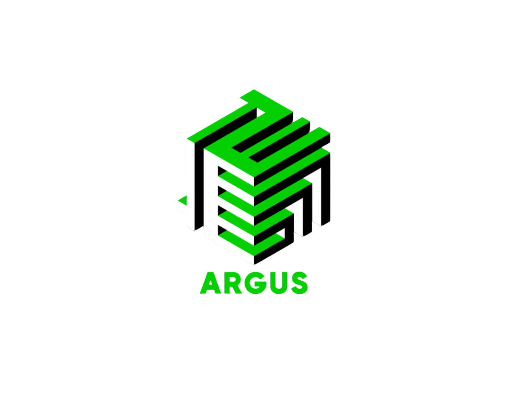

  

<h1 align="center">ARGUS</h1>

AI-Powered Autonomous Network Defense Appliance

# ARGUS

## Autonomous Real-time Gateway Unsupervised Shield

ARGUS is an AI-powered autonomous network defense system designed to detect, classify, and mitigate cyber threats in real time.

Unlike traditional network monitoring tools that only alert administrators after an attack has occurred, ARGUS actively analyzes network traffic, identifies suspicious behavior using Machine Learning, and initiates automated defensive actions against malicious entities.

---

## Problem Statement

Cyber threats such as port scanning, denial-of-service attacks, botnet activity, and unauthorized network reconnaissance continue to increase across educational institutions, small businesses, hospitals, and rural infrastructures.

Most advanced cybersecurity solutions are expensive, complex to deploy, and require dedicated security personnel.

Organizations with limited cybersecurity expertise often remain vulnerable to attacks.

---

## Our Solution

ARGUS introduces a lightweight and scalable network defense appliance capable of:

* Monitoring network traffic continuously
* Extracting meaningful packet-level features
* Detecting anomalies using Machine Learning
* Classifying malicious activities
* Automatically responding to threats
* Providing real-time monitoring and alerting

---

## Key Features

### Real-Time Packet Analysis

Captures and analyzes network traffic continuously.

### Machine Learning Detection

Uses anomaly detection models to identify suspicious behavior.

### Automated Threat Response

Initiates defensive actions against malicious IP addresses.

### Live Dashboard

Provides real-time visibility into network activity and detected threats.

### Future Router Integration

Designed for deployment as a dedicated cybersecurity appliance or direct router integration.

---

## System Architecture

Network Traffic
→ Packet Capture
→ Feature Extraction
→ Machine Learning Analysis
→ Threat Classification
→ Automated Response
→ Dashboard & Alerts

---

## Current Prototype

The current implementation operates on a development workstation for demonstration and validation purposes.

This prototype validates the complete ARGUS detection pipeline while the future product vision targets deployment on:

* Dedicated cybersecurity appliances
* Embedded hardware platforms
* Router-integrated environments
* Enterprise edge-security solutions

---

## Prototype Status

The current implementation is a software prototype demonstrating the complete ARGUS detection pipeline. Future versions are intended for deployment as dedicated cybersecurity appliances and router-integrated security solutions.

---

## Repository Structure

src/

* Detection Engine
* Dashboard Components

models/

* Trained Machine Learning Models

deployment/

* Platform-specific launch scripts

docs/

* Architecture and system documentation

hardware/

* Future deployment roadmap

---

## Technology Stack

* Python
* Scikit-Learn
* Pandas
* NumPy
* Scapy
* Bettercap
* Streamlit
* Machine Learning

---

## Future Vision

ARGUS aims to evolve from a software prototype into a self-contained cybersecurity appliance capable of protecting organizations that lack access to enterprise-grade security infrastructure.

---

## ARGUS Development Team

Khatwang Madhav Yippili

Karthikeya Bodanki
